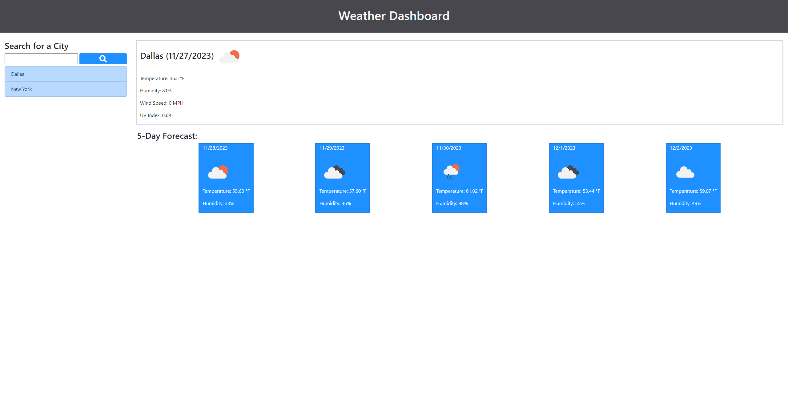
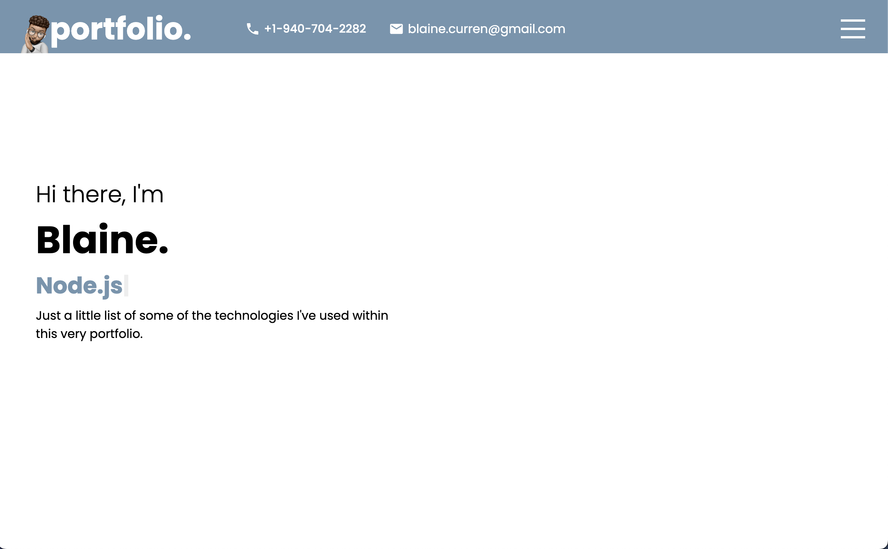

<h1 align="center">Hi 👋🏽, I'm Blaine Curren</h1>
<h3 align="center">"A Full Stack Web Developer, bringing a robust skill set and hands-on experience in designing and implementing scalable web applications. With a keen eye for detail and a passion for innovation, I am eager to contribute my expertise to a dynamic team.</h3>

  
  

<h1 align="center">Projects</h1>
<table bordercolor="#66b2b2">
  
  <tr>
   <td width="50%" valign="top">
      <h3 align="center">ClimaView</h3>
         
      
         
        

          
  
  
      

        
<strong>JavaScript, HTML5, & Bootstrap</strong> - Get real-time updates on temperature, precipitation, and wind conditions with ClimaView, the intuitive weather dashboard.

    </td>
    <td width="50%" valign="top">
      <h3 align="center">Estate Evalu8</h3>
         
      
         
        

          
  
  
      

        
<strong>Project Tech</strong> - Project Info

    </td>
  </tr>
  
  <tr>
    <td width="50%" valign="top">
      <h3 align="center">blainecurren.com</h3>
       
        
       
        

  
  
      

        
<strong>Javascript, CSS, Sass, HTML, React</strong> - Portfolio site with links to my projects

    </td>
    <td width="50%" valign="top">
      <h3 align="center">BrainStormer</h3>
         
        
         
        

          
  
  
      

        
<strong>Javscript, EJS, HTML, Tailwind</strong>Project Info

    </td>
  </tr>
</table>

<h3 align="center">Connect with me:</h3>

<h3 align="center">Languages and Tools:</h3>

               

